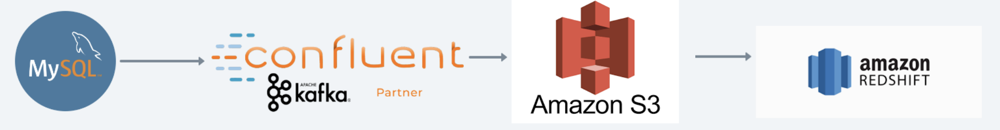

# Big Data Pipeline

Tech Stack >> AWS, Docker, PySpark, SQL, Python, Confluent Kafka.


**In thie project, I aim to design an ETL pipeline.I have used Docker and PySpark along with MySQL as database and Redshift as DataWareHouse.**

## Big Data Pipeline : MySQL-Kafka-S3-RedShift using PySpark and Docker.



### Context

- Introduction and Problem Statement
- About the dataset
- Components of the pipeline
- Pipeline part 1 - MySQL → Kafka → S3
- Pipeline part 2 - S3 → RedShift

---

## Introduction and Problem Statement

In thie project, I aim to design an ETL pipeline.

I have used Docker and PySpark along with MySQL as database and Redshift as DataWareHouse.

An ETL pipeline is used in various scenarios where there is a need to process and analyze large volumes of data from different sources.

My pipeline consists of 4 Stages:  **MySQL --> Kafka --> S3 --> RedShift**

---

## About the dataset

I have used Classic Model Sample Database from [MySQL Tutorials](http://www.mysqltutorial.org/mysql-sample-database.asp)

**Database Schema**


---

## Components of the Pipeline

Below is the explanation of role and function of each component

### MySQL

**Role:** MySQL is a relational database management system. It's used as a source of structured data.
**Function:** In this pipeline, MySQL serves as a data source. It could contain various types of data like transaction records, customer information, product details, etc.

### Kafka

**Role**: Kafka is a distributed streaming platform that allows you to publish and subscribe to streams of records (messages). It's known for its high-throughput, fault-tolerant, and real-time data processing capabilities.
**Function:** As we don’t want to invoke our pilepine too frequently we use kafka a messaging/queueing system which acts as a message broker between MySQL and S3. Data from MySQL can be extracted, transformed (if necessary), and then pushed into Kafka topics. Kafka ensures that this data can be efficiently consumed by downstream processes.

### S3

**Role:** Amazon Simple Storage Service (S3) is an object storage service provided by AWS. It's used for storing and retrieving any amount of data from anywhere on the web.
**Function:** In this pipeline, S3 serves as a staging area or data lake. Kafka can write data directly to S3 or it can be used as an intermediate step before loading into Redshift. When we transfer, sometime something might goes wrong so we use a storage such as S3 so as to export data from MySQL to S3 and then from S3 we can move to Redshift.

### RedShift

**Role:** Amazon Redshift is a fully managed, fast, and powerful data warehousing solution provided by AWS.
**Function:** Redshift serves as the data warehouse in this pipeline. Data from S3 can be loaded into Redshift for further processing and analysis. Redshift is designed to handle large volumes of structured data and enables complex queries for reporting and analytics.

---

## Pipeline Part 1 - MySQL → Kafka → S3


### Container : pyspark

The main task here is to move the data from our MySQL database to S3. 

We use kafka which is an open-source distributed streaming system used for stream processing, real-time data pipelines.

The producer writes the data to kafka and then the consumer reads the kafka data and transfers it to S3 bucket.

### What does the Source code contain ! ?

```markdown
|-> logs                            # contains log file
|-> src                             # root folder for source code
    |->config                       # configuration related code
        |-> __init__.py
        |-> environment.py           # All environment variable will be made available by this module.created 4 named tuple to access env varibales
        |-> spark_manager.py         # customize spark session will be created 
    |->consumer
        |-> __init__.py
        |-> kafka_reader.py          # Reading data from kafka topic and writing to s3 bucket
    |->enitity
        |-> __init__.py              # Structures for all topics which we will need when we want to read data from kafka topics
    |->producer
        |-> __init__.py
        |-> kafka_writer.py          #Reading data from MYSQL and writing to kafka topic
    |->utils
        |-> __init__.py              # All helper function which will be used to work with reading data from MYSQL 
    |->__init__.py                  # dot env module help us to read all env variable from .env file
```

### Producer and Consumer

> **src/producer/kafka_writer.py** 
-> This file containes function to read data from MYSQL database and send them to kafka topics

**src/consumer/kafka_reader.py** 
-> This file containes function that read data from Kafka topic and overwrites record to s3 bucket.
> 

### main

> **Producer.py** 
-> calls the "produce_data_to_kafka_topics()" function in producer/kafka_writer.py file

**Consumer.py** 
-> calls the "write_kafka_to_s3()" function in consumer/kafka_reader.py file
> 

---

## Pipeline Part 2 - S3 → RedShift


### Container : hadoop-pysaprk

Now we will export data from S3 to RedShift.

The sequence of steps here is:

1. Reading data from s3 using Pyspark
2. Do required transformation on dataset
3. Dump data to Redshift using pyspark

### RedShift OLAP Schema

A Star Schema was used so that we can export above attached OLTP to OLAP


### What does the Source code contain ! ?

```markdown
- src/entity --> we define the structure type (schema) of the data.

- src/utils --> we define functions to read , write and query df from redshift.

- src/config/
  - environment.py --> to set up envirnments variables which we defined in our .env file
  - spark-manager.py --> configurations for spark-session

- src/pipeline/
  - s3_to_redshift.py --> function which does the main task "transfer_data_from_s3_to_redshift" is written here.
```

### main

The [main.py](http://main.py) calls the “transfer_data_from_s3_to_redshift()” from “src/pipeline/s3_to_redshift”

The function uses utility functions, env varibales, and db schema to put the data to RedShift DWH.

---

## Conclusion

> Thus we built an ETL pipeline to dump mysql data base record to redshift using kafka.

---
